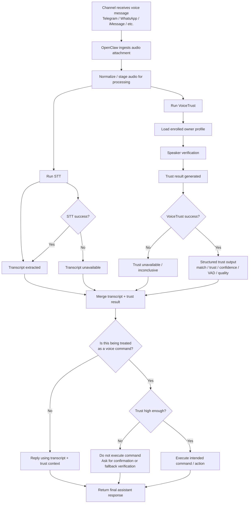

# VoiceTrust

VoiceTrust is a voice-message trust project for OpenClaw.
It is designed to answer one practical question in real channel workflows:

> Is this incoming voice message likely to be spoken by the enrolled owner?

Instead of treating voice as only a transcription problem, VoiceTrust adds an ownership/trust layer on top of voice-message handling.
Its purpose is to help OpenClaw distinguish between:
- audio that likely comes from the enrolled owner
- audio that is unclear, low-confidence, or potentially not from the owner

VoiceTrust is not positioned as perfect biometric authentication.
It is a practical trust signal for automation and assistant workflows.

---

## End-to-End Voice Message Flow

The diagram below shows the intended OpenClaw workflow after a voice message is received from a channel.
This is not a code-structure diagram — it is the operational flow of how STT and VoiceTrust work together.



In short:
- **STT** answers: “What was said?”
- **VoiceTrust** answers: “Who likely said it, and how confident are we?”
- OpenClaw should use **both** before replying or acting on voice input.

---

## What VoiceTrust Does

VoiceTrust focuses on the trust side of voice handling.

Current core capabilities include:
- owner voice enrollment with multiple samples
- speaker verification against an enrolled owner profile
- aggregate owner embedding generation
- structured trust output for downstream agent use
- packaging as an OpenClaw skill bundle

Typical trust output includes:
- `speaker_match`
- `audio_quality`
- `overall_trust`
- `confidence`
- `speech_duration`
- `speech_ratio`
- `vad_status`
- `failure_reason`

---

## Typical Usage Pattern

VoiceTrust is intended to work **alongside STT**, not replace it.

Normal flow:
1. a voice message arrives
2. STT extracts the content
3. VoiceTrust evaluates whether the speaker likely matches the enrolled owner
4. the agent combines transcript + trust result before replying or acting

Recommended policy:
- if the audio is being used as a **voice command**, low trust should block execution
- if the audio is ordinary conversational content, low trust does not automatically require discarding the transcript

---

## Quickstart

For normal OpenClaw usage, the intended path is to use the packaged skill from a release build.

### Install from release package

1. Download the VoiceTrust release zip
2. Extract it
3. After extraction, you should get a `VoiceTrust/` folder
4. Put that `VoiceTrust/` folder into the appropriate OpenClaw skill directory
5. After it is placed correctly, tell the agent to start using **VoiceTrust**

Practical example of what to tell the agent:
- “Start using VoiceTrust for incoming voice messages.”
- “Use VoiceTrust on this audio.”
- “Treat VoiceTrust as the trust layer for voice handling.”

In normal OpenClaw use, the agent should:
- load the skill when voice-trust handling is needed
- run STT for content
- run VoiceTrust for speaker trust
- merge both before acting or replying

---

## Quick for Dev

Use this path if you are developing, testing, or modifying the project locally.

### 1. Create a local environment

```bash
uv venv .venv
uv pip install --python .venv/bin/python -r requirements.txt
uv pip install --python .venv/bin/python torchcodec
```

### 2. Enroll owner samples

Use **3 to 5** clean voice samples from the same person.

```bash
uv run --python .venv/bin/python scripts/demo.py \
  --audio /path/to/owner_sample_01.wav \
  --speaker owner \
  --enroll-sample \
  --json
```

Repeat with additional owner samples.

### 3. Check enrolled owners

```bash
uv run --python .venv/bin/python scripts/demo.py --list-speakers
```

Expected shape:

```text
Owner profiles:
  - owner
```

### 4. Verify a voice message

```bash
uv run --python .venv/bin/python scripts/demo.py \
  --audio /path/to/incoming_audio.ogg \
  --speaker owner \
  --json
```

---

## Repository Layout

```text
VoiceTrust/
├── README.md
├── LICENSE
├── pyproject.toml
├── requirements.txt
├── configs/
├── assets/models/
├── scripts/demo.py
├── src/
├── docs/
├── archive/
└── Skill-VoiceTrust/
```

Main parts:
- `scripts/demo.py` — local CLI/demo entrypoint
- `src/` — core runtime logic
- `configs/` — current runtime config
- `assets/models/` — local model assets used by the project
- `docs/` — project notes and public-facing documentation
- `archive/` — historical materials not needed for normal use
- `Skill-VoiceTrust/` — portable skill bundle for OpenClaw-style use

---

## Skill Bundle

This repository includes a bundled OpenClaw-oriented skill package under `Skill-VoiceTrust/`.

It contains:
- `Skill-VoiceTrust/SKILL.md`
- `Skill-VoiceTrust/references/quickstart.md`
- `Skill-VoiceTrust/scripts/demo.py`
- `Skill-VoiceTrust/runtime/`

Use the skill bundle when you want a portable, self-contained VoiceTrust package
separate from the full project repository.

---

## Current Limitations

Current limitations include:
- owner verification is the main supported path
- anti-spoofing is not yet a complete production feature
- trust scoring is heuristic and practical, not a formal identity proof
- model assets are currently stored directly in the repository for bootstrap convenience

---

## License

MIT
