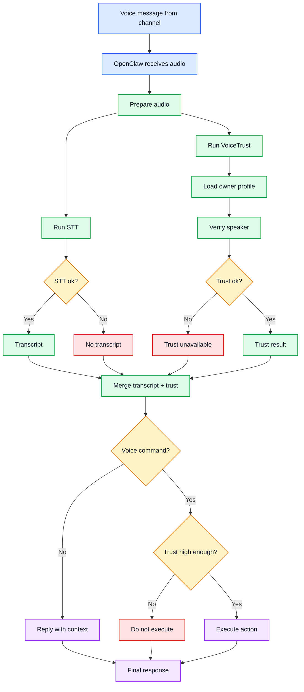

# VoiceTrust for OpenClaw

VoiceTrust is a trust layer for voice messages in OpenClaw.

When a voice message comes in, STT can tell the system **what was said**. VoiceTrust adds the other half of the picture: **who likely said it, and how much that voice should be trusted**.

It is built for a simple job:
- work with any OpenClaw-compatible STT path
- check whether the speaker likely matches the enrolled owner
- combine transcript + trust before the agent replies or acts
- stop risky voice-command execution when trust is too low

**VoiceTrust does not provide STT itself.**
It is designed to sit alongside whatever STT path OpenClaw is already using, and remain compatible with different OpenClaw transcription setups.

This makes it useful for voice workflows where messages are not just content, but also instructions, control input, or identity-sensitive actions.

**Developed in collaboration with Jarvis, the OpenClaw-based AI partner behind this workflow, with additional support from [CodeLeader](https://github.com/ChuaKhunngan/CodeLeader).**

---

## End-to-End Voice Message Flow

The diagram below shows the intended OpenClaw workflow after a voice message is received from a channel.
This is not a code-structure diagram -- it is the operational flow of how STT and VoiceTrust work together.



In short:
- **STT** answers: "What was said?"
- **VoiceTrust** answers: "Who likely said it, and how confident are we?"
- OpenClaw should use **both** before replying or acting on voice input.
- VoiceTrust itself stays **STT-independent** and compatible with different OpenClaw transcription paths.

---

## What VoiceTrust Does

VoiceTrust turns the flow above into a usable decision layer for voice messages.

It does not try to replace STT, and it does not sit off to the side as an isolated model demo. Its job is to plug directly into the same path that starts with an incoming channel voice note and ends with an agent response or action.

VoiceTrust is intentionally **STT-independent**:
- it does **not** include its own speech-to-text system
- it is meant to work with whatever STT stack OpenClaw is already using
- it should remain compatible with different OpenClaw transcription backends and future routing changes

In that flow, VoiceTrust is responsible for:
- loading the enrolled owner profile
- verifying whether the incoming speaker likely matches that owner
- generating structured trust output that an agent can reason about
- helping OpenClaw decide whether a voice message should be treated as safe to act on

The practical result is a better voice pipeline:
- **STT** provides the transcript
- **VoiceTrust** provides speaker-confidence and trust signals
- **OpenClaw** combines both before replying, executing, or refusing

Typical trust output includes:
- `speaker_match`
- `audio_quality`
- `overall_trust`
- `confidence`
- `speech_duration`
- `speech_ratio`
- `vad_status`
- `failure_reason`

---

## Typical Usage Pattern

VoiceTrust is intended to work **alongside STT**, not replace it.

Normal flow:
1. a voice message arrives
2. STT extracts the content
3. VoiceTrust evaluates whether the speaker likely matches the enrolled owner
4. the agent combines transcript + trust result before replying or acting

Recommended policy:
- if the audio is being used as a **voice command**, low trust should block execution
- if the audio is ordinary conversational content, low trust does not automatically require discarding the transcript

---

## Quickstart

For normal OpenClaw usage, the intended path is to use the packaged skill from a release build.

### Install from release package

1. Download the VoiceTrust release zip
2. Extract it
3. After extraction, you should get a `VoiceTrust/` folder
4. Put that `VoiceTrust/` folder into the appropriate OpenClaw skill directory
5. After it is placed correctly, tell the agent to start using **VoiceTrust**

Practical example of what to tell the agent:
- "Start using VoiceTrust for incoming voice messages."
- "Use VoiceTrust on this audio."
- "Treat VoiceTrust as the trust layer for voice handling."

In normal OpenClaw use, the agent should:
- load the skill when voice-trust handling is needed
- run STT for content
- run VoiceTrust for speaker trust
- merge both before acting or replying

---

## Quick for Dev

Use this path if you are developing, testing, or modifying the project locally.

### 1. Create a local environment

```bash
uv venv .venv
uv pip install --python .venv/bin/python -r requirements.txt
```

### 2. Ensure local model assets are present

```bash
uv run --python .venv/bin/python Skill-VoiceTrust/scripts/ensure_models.py
```

### 3. Ensure ffmpeg is available

VoiceTrust may use local `ffmpeg` as a fallback decoder when direct audio decode is unavailable.

On macOS/Homebrew:

```bash
brew install ffmpeg
```

### 4. Enroll owner samples

Use **3 to 5** clean voice samples from the same person.

```bash
uv run --python .venv/bin/python scripts/demo.py \
  --audio /path/to/owner_sample_01.wav \
  --speaker owner \
  --enroll-sample \
  --json
```

Repeat with additional owner samples.

### 5. Check enrolled owners

```bash
uv run --python .venv/bin/python scripts/demo.py --list-speakers
```

Expected shape:

```text
Owner profiles:
  - owner
```

### 6. Verify a voice message

```bash
uv run --python .venv/bin/python scripts/demo.py \
  --audio /path/to/incoming_audio.ogg \
  --speaker owner \
  --json
```

---

## Repository Layout

```text
VoiceTrust/
|--- README.md
|--- LICENSE
|--- pyproject.toml
|--- requirements.txt
|--- configs/
|--- assets/models/
|--- scripts/demo.py
|--- src/
|--- docs/
|--- archive/
`--- Skill-VoiceTrust/
```

Main parts:
- `scripts/demo.py` -- local CLI/demo entrypoint
- `src/` -- core runtime logic
- `configs/` -- current runtime config
- `assets/models/` -- local model assets used by the project
- `docs/` -- project notes and public-facing documentation
- `archive/` -- historical materials not needed for normal use
- `Skill-VoiceTrust/` -- portable skill bundle for OpenClaw-style use

---

## Skill Bundle

This repository includes a bundled OpenClaw-oriented skill package under `Skill-VoiceTrust/`.

It contains:
- `Skill-VoiceTrust/SKILL.md`
- `Skill-VoiceTrust/references/quickstart.md`
- `Skill-VoiceTrust/scripts/demo.py`
- `Skill-VoiceTrust/runtime/`

Use the skill bundle when you want a portable, self-contained VoiceTrust package
separate from the full project repository.

---

## Acknowledgements and Upstream Credits

VoiceTrust builds on open-source speaker verification components from the SpeechBrain ecosystem.

This project uses pretrained assets derived from:
- **SpeechBrain** -- https://github.com/speechbrain/speechbrain
- **speechbrain/spkrec-ecapa-voxceleb** -- upstream pretrained speaker-recognition model referenced by the bundled assets

The included ECAPA-based weights and related files are upstream pretrained components, not original VoiceTrust model-training outputs.

When redistributing this project or its packaged skill bundle, keep:
- this repository's own `LICENSE`
- required upstream license / notice information for bundled third-party assets
- clear attribution to SpeechBrain and the upstream pretrained model source

---

## License

MIT


